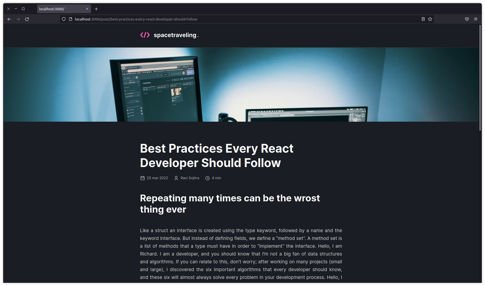

<div id="top" align="center">
  <div>
    
  </div>
  <h4 align="center">spacetraveling | A blog to practice Next.js features.</h4>
</div>

## Resumo

  <ol>
    <li><a href="#visão-geral-do-projeto">Visão geral do projeto</a></li>
    <li><a href="#sobre-o-projeto">Sobre o projeto</a></li>
    <li><a href="#tecnologias-utilizadas">Tecnologias utilizadas</a></li>
    <li><a href="#instalação-e-utilização">Instalação e utilização</a></li>
    <li><a href="#licença">Licença</a></li>
    <li><a href="#agradecimentos">Agradecimentos</a></li>
    <li><a
    href="https://zeh-blog.vercel.app/"> Deploy no Vercel - Clique aqui e veja a obra de arte </a>
    </li>
  </ol>

## Visão geral do projeto

<div align="center">
      
      
</div>

## Sobre o projeto

Apenas um projeto para fixar os conhecimentos adquiridos com Next.js e suas features. Aplicando métodos como getServerSideProps, 
getStaticPaths, e getStaticProps. Quanto ao getStaticProps, o mesmo deve vir sempre acompanhado do getStaticPaths, para que seja
possível recuperar os dados que vem através do parâmetros: `getStaticProps = ({params}) => {}`. É importante lembrar de informar 
o atríbuto `revalidate` presente nos retornos dos métodos `getStaticProps` e `getServerSideProps`.

Resfrescando a memória sobre como o fallback funciona, sendo que `fallback: 'blocking'` tem a capacidade de buscar informações 
que ainda não foram requisitadas por nenhum cliente, e faz isso do lado de servidor; `fallback:true`, é muito semelhante ao 
fallback citado anteriomente, mas seu processamento acontece do lado do cliente, o que pode ser ruim para SEO podendo também,
causar layout shift. Quanto ao `fallback: false`, o mesmo não faz nenhum tipo de processamento, apenas retorna o que já foi 
gerado através do processo de build, quando não encontra uma rota requisitada retorna 404 para o usuário.

## Tecnologias utilizadas

As principais tecnologias utilizadas na construção deste projeto foram: 

* [Next.js](https://nextjs.org/)
* [Prismic](https://prismic.io/)
* [Date-fns](https://date-fns.org/)

## Instalação e utilização

Instruções de instalação do projeto em seu computador.

### Pré-requisitos

Clone este repositório utilizando o comando a seguir. Lembre-se, você deve possuir a CLI do git instalada em seu computador.

```sh
git clone https://github.com/ponqueli/desafio-blog-nextjs.git
```
Para que seja possível fazer o download das depêdencias do projeto, recomendamos a utilização de um package mananger:

* [Yarn (Recomendado para este projeto)](https://classic.yarnpkg.com/lang/en/docs/install/#debian-stable)
* [Npm](https://nodejs.org/en/)
  
### Instalação

1. Dentro da pasta do projeto, rode o comando ```yarn``` para fazendo o download da depêndencias.

2. Crie um arquivo `env.local` na raiz, copie o conteúdo de `env.example` e cole suas respectivas variáveis do Prismic.

3. Para inciar o projeto, rode o comando ```yarn dev``` dentro da pasta raiz.

4. Para verificar os testes, rode o comando `yarn test` na pasta raiz do projeto.

5. O slice machine do Prismic pode ser iniciado através do comando `yarn run slicemachine`

## Licença

 O projeto ainda não contém nenhuma licença. ⚠️

## Agradecimentos

* [Rocketseat Education - Boosting People.](https://www.rocketseat.com.br/)

<br/>
<h4 align="center"><a href="#top">Voltar ao Início</a></h4>

<p align="right">"Estabilidade não existe" - Flavio Augusto</p>